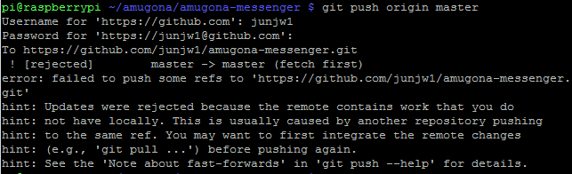

# 원격 저장소 활용하기 ( push - pull )

### 준비사항

* 1번 PC_01에 git 저장소 만들기

```bash
$ git init
$ touch a.txt
$ git add.
$ git commit origin master
```


* 2번 PC_02에 git 저장소 만들기

```bash
$ git clone {url}
```

> clone은 init과 비슷하게 동작한다.

* github `Remote Repo` 만들기


### 시나리오
> 작업을 완료한 이후에는 항상 push
> 작업을 시작하기 전에는 항상 pull

1. PC_01 도착
```bash
# pull
$git pull origin master
```

2. PC_01 작업 시작

```bash
# 임의의 작업 시작. 수정/생성/삭제 등
$ git add .
$ git commit -m '{message}'

# 작업 끝
$ git push origin master
```

3. PC_02 도착
```bash
#pull
$git pull origin master
```
4. PC_02 작업 시작
```bash
# 임의의 작업 시작. 수정/생성/삭제 등
$ git add .
$ git commit -m '{message}'

# 작업 끝
$ git push origin master
```


# 충돌 상황

> Remote와 Local의 이력이 다를 경우 아래의 메세지가 발생한다.



* 로컬에서 `$ git log -p` `$ git log --oneline` , 리모트에서의 `commit history`를 확인하고 다른 부분을 체크하자.

```bash
$ git pull origin master
```

일단 pull로 리모트에서 갖고오고

```bash
$ git push origin master
```

push로 합치기. (코드끼리 충돌이 없길 바라며..)


### 상황 1. fast-foward

> fast-foward는 feature 브랜치 생성된 이후 master 브랜치에 변경 사항이 없는 상황

1. feature/test branch 생성 및 이동

   ```bash
   $ git checkout -b {branch_name}
   ```

2. 작업 완료 후 commit

   ```bash
   $ touch test.txt
   $ git add .
   $ git commit -m 'New test'
   ```

3. master 이동

   ```bash
   (feature/test) $ git checkout master
   				Switched to branch 'master'
   (master) $
   ```

4. master에 병합

   ```bash
   $ git merge feature/test
   ```

5. 결과 -> fast-foward (단순히 HEAD를 이동)

   ```bash
   Updating 7fa374c..bcb0cbf
   Fast-forward
    test.txt | 0
    1 file changed, 0 insertions(+), 0 deletions(-)
    create mode 100644 test.txt
   ```

   

6. branch 삭제

------

### 상황 2. merge commit

> 서로 다른 이력(commit)을 병합(merge)하는 과정에서 다른 파일이 수정되어 있는 상황
>
> git이 auto merging을 진행하고, commit이 발생된다.

1. feature/signout branch 생성 및 이동

   ```bash
   $ git checkout -b feature/signout
   ```

2. 작업 완료 후 commit

   ```bash
   
   ```

   

3. master 이동

   ```bash
   
   ```


4. *master에 추가 commit 이 발생시키기!!*

   - **다른 파일을 수정 혹은 생성하세요!**

5. master에 병합

   ```bash
   
   ```


6. 결과 -> 자동으로 *merge commit 발생*
   - vim 편집기 화면이 나타납니다.
   - 자동으로 작성된 커밋 메시지를 확인하고, `esc`를 누른 후 `:wq`를 입력하여 저장 및 종료를 합니다.
     - `w` : write
     - `q` : quit
   - 커밋이 확인 해봅시다.

7. 그래프 확인하기

8. branch 삭제

------

### 상황 3. merge commit 충돌

> 서로 다른 이력(commit)을 병합(merge)하는 과정에서 동일 파일이 수정되어 있는 상황
>
> git이 auto merging을 하지 못하고, 해당 파일의 위치에 라벨링을 해준다.
>
> 원하는 형태의 코드로 직접 수정을 하고 merge commit을 발생 시켜야 한다.

1. feature/board branch 생성 및 이동

2. 작업 완료 후 commit

3. master 이동

4. *master에 추가 commit 이 발생시키기!!*

   - **동일 파일을 수정 혹은 생성하세요!**

5. master에 병합

6. 결과 -> *merge conflict발생*

7. 충돌 확인 및 해결

8. merge commit 진행

   ```
   $ git commit
   ```

   - vim 편집기 화면이 나타납니다.
   - 자동으로 작성된 커밋 메시지를 확인하고, `esc`를 누른 후 `:wq`를 입력하여 저장 및 종료를 합니다.
     - `w` : write
     - `q` : quit
   - 커밋이 확인 해봅시다.

9. 그래프 확인하기

10. branch 삭제

